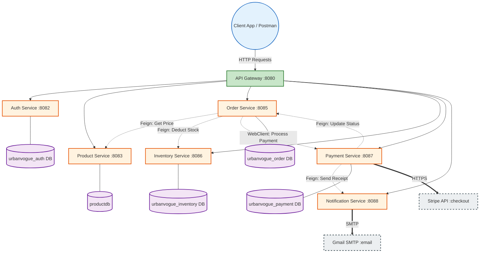

```mermaid
graph TD
    classDef client fill:#e3f2fd,stroke:#1565c0,stroke-width:2px;
    classDef gateway fill:#c8e6c9,stroke:#2e7d32,stroke-width:2px;
    classDef service fill:#fff3e0,stroke:#e65100,stroke-width:2px;
    classDef db fill:#f3e5f5,stroke:#6a1b9a,stroke-width:2px;
    classDef external fill:#eceff1,stroke:#37474f,stroke-width:2px,stroke-dasharray: 5 5;

    %% Client and Gateway
    Client(("Client App / Postman")):::client -->|"HTTP Requests"| API["API Gateway :8080"]:::gateway
    
    %% Core Services
    API --> Auth["Auth Service :8082"]:::service
    API --> Product["Product Service :8083"]:::service
    API --> Order["Order Service :8085"]:::service
    API --> Inventory["Inventory Service :8086"]:::service
    API --> Payment["Payment Service :8087"]:::service
    API --> Notif["Notification Service :8088"]:::service

    %% Service to Service Communication
    Order -.->|"Feign: Get Price"| Product
    Order -.->|"Feign: Deduct Stock"| Inventory
    Order -.->|"WebClient: Process Payment"| Payment
    Payment -.->|"Feign: Update Status"| Order
    Payment -.->|"Feign: Send Receipt"| Notif

    %% Databases
    Auth --- DB_Auth[("urbanvogue_auth DB")]:::db
    Product --- DB_Prod[("productdb")]:::db
    Inventory --- DB_Inv[("urbanvogue_inventory DB")]:::db
    Order --- DB_Order[("urbanvogue_order DB")]:::db
    Payment --- DB_Pay[("urbanvogue_payment DB")]:::db

    %% External Systems
    Payment == "HTTPS" ==> Stripe["Stripe API :checkout"]:::external
    Notif == "SMTP" ==> Gmail["Gmail SMTP :email"]:::external
```
