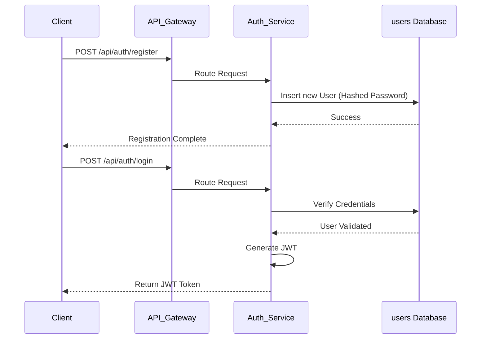
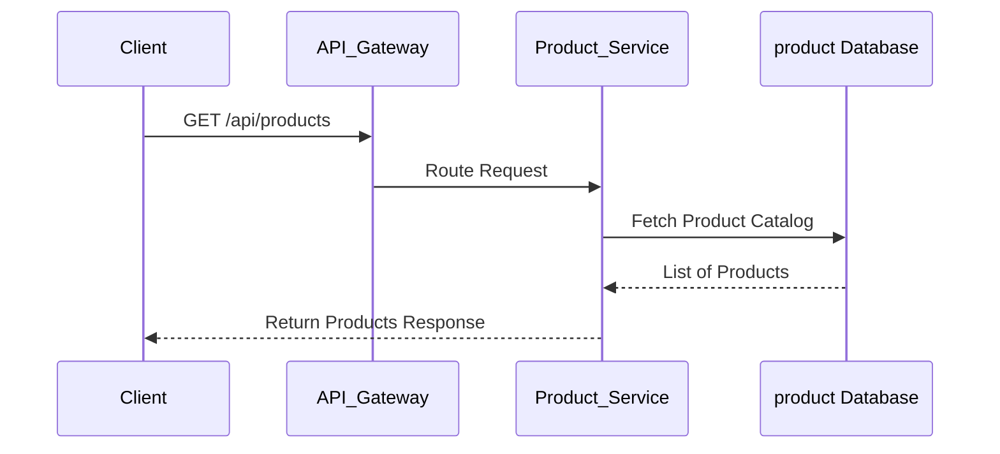
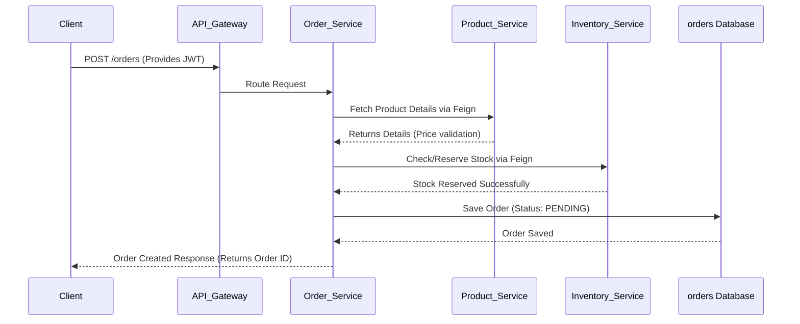
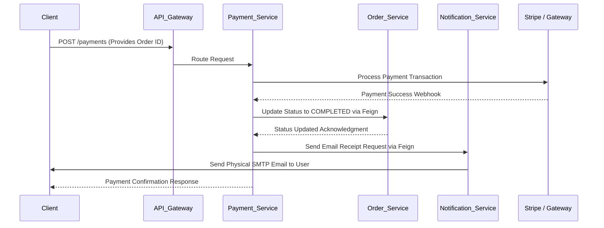

# UrbanVogue Microservices Workflows

This document visualizes the complete end-to-end workflows of the core operations in the UrbanVogue e-commerce architecture using Mermaid sequence diagrams.

## 1. User Authentication (Registration & Login)
This flow demonstrates how a user creates an account and authenticates to receive a JSON Web Token (JWT).

---

## 2. Product Browsing
This flow demonstrates how a user views the product catalog. Only the Product Service is involved here.

---

## 3. Order Placement Workflow
This is the core transaction. The Order Service acts as an orchestrator, synchronously communicating with Product and Inventory services via OpenFeign.

---

## 4. Payment Processing & Notification Workflow
After an order is PENDING, the user initiates payment. The Payment Service orchestrates the transaction, updates the order status, and triggers the email receipt.

